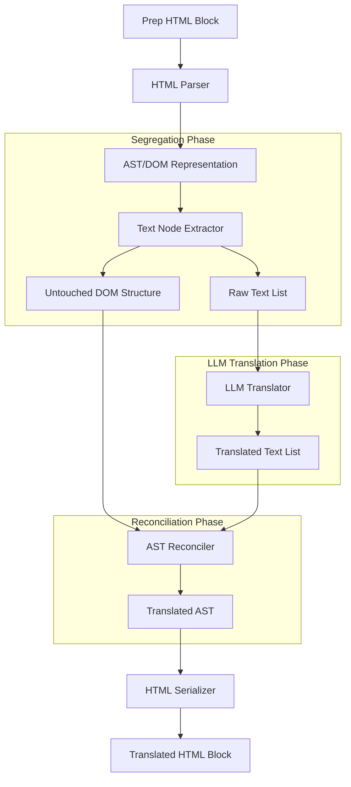

# ADR-001: AST-Based Segregation Translation Pipeline

## Status
Proposed

## Context
Currently, the Libero Translation Engine uses a regex-based approach (`src/pipeline/translate/math_protection.py`) to protect math formulas and statistical markers. It replaces match patterns with sequential placeholders like `[[PROTECTED_TAG_0]]` and then sends the entire HTML block (including inline formatting tags such as `<em>`, `<strong>`, `<a>` and the placeholders) to the LLM for translation.

However, this approach suffers from several key limitations:
1. **Formatting Corruption:** The LLM often misplaces, modifies, or deletes inline HTML tags (e.g., losing links `<a>` or formatting `<em>`).
2. **Placeholder Tampering:** The LLM occasionally translates, modifies, or swaps the sequence of the `[[PROTECTED_TAG_N]]` placeholders, causing restoration failures.
3. **Restoration Complexity:** When the LLM changes the syntax structure (e.g., merging sentences, altering word order), mapping the translated string back to the original placeholders becomes highly error-prone.
4. **Redundant Token Overhead:** Sending repetitive and complex HTML structures (like nested MathML or large HTML tables) to the LLM increases token usage and latency.

To scale the translation engine safely to multiple textbooks with complex math and rich typography, we need a translation pipeline that guarantees 100% HTML structure integrity.

## Decision
We propose moving to an **AST-Based Segregation Translation Pipeline**. Instead of sending HTML fragments to the LLM, the system will parse the HTML into an Abstract Syntax Tree (AST), segregate the structural layers from the natural language text, translate only the text, and deterministically reconstruct the translated HTML.

### Proposed Workflow
1. **HTML Parsing:** The pipeline parses each `04-prep/` HTML block into a BeautifulSoup DOM / AST object.
2. **Text Segregation:**
   - The engine traverses the AST and identifies all `NavigableString` (Text) nodes.
   - Blocks containing no alphabetic characters (e.g., numbers, standalone math operators, space-only nodes) are skipped.
   - Translatable text segments are extracted. 
   - *Inline Tag Preservation:* To maintain inline semantics (like bold text or links), inline tags (e.g., `<a>`, `<em>`, `<strong>`, ``, ``) can be abstracted into lightweight placeholders (e.g., `{0}`, `{1}`) inside the translatable string rather than raw HTML.
3. **Segregated Translation:** Only the raw text strings (with lightweight inline placeholders if any) are sent to the LLM in a structured JSON batch. MathML blocks, complex table structures, tag attributes (IDs, classes), and block hierarchy never reach the LLM.
4. **AST Reconciliation & Reassembly:**
   - The engine receives the translated text strings.
   - It replaces the corresponding Text node values in the memory AST.
   - If inline placeholders were used, they are resolved back to their original tag nodes with the translated text wrapped inside.
5. **Serialization:** The modified memory AST is serialized back to HTML, guaranteeing that the document structure is identical to the source.

### Architecture Diagram

## Consequences

### Consequences - Advantages
- **100% Structure Integrity:** Block-level layout tags (`
`, `
`, `<ul>`, `<table>`), ID attributes, CSS classes, and MathML structures are mathematically guaranteed to remain unmodified because the LLM never sees them.
- **Improved Math Protection:** Since MathML is kept separate, there is zero risk of MathML syntax corruption or math variables getting mistranslated.
- **Token Efficiency:** We avoid sending bulky MathML structures, attributes, and tags to the LLM, leading to significant token savings (often 30–50% for math-heavy sections) and faster API response times.
- **Predictable Error Recovery:** If translation fails, we can fall back on text-only segments without corrupting the surrounding page layout.

### Consequences - Challenges
- **Context Loss:** When text is split across multiple child nodes (e.g., a sentence split by a hyperlink or superscript), sending individual text chunks to the LLM might lead to sub-optimal translations.
  *Mitigation:* Inline formatting tags (like `<a>`, `<em>`) should be abstracted as part of the sentence string using lightweight placeholders (e.g. `Click {0} here {1} to see.`) so the LLM retains sentence-level context.
- **Increased Engineering Complexity:** The code must robustly handle AST traversal, tree updates, and inline placeholder mapping.
