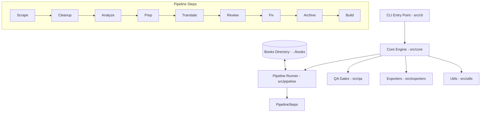

# Libero Translation Engine Architecture

Libero is a stateless, CLI-driven, and Human-in-the-Loop (HITL) translation engine designed to translate structured open textbooks (such as OpenStax) from English to Vietnamese.

## Design Philosophy

### 1. Stateless Execution
The core translation engine (`translate-agents`) is designed to be completely stateless. 
- It does **not** store raw book chapters, source HTML, assets, or translated files within its own repository.
- All persistent book data resides in a separate sibling directory structure or external storage (e.g., `../books/<book-slug>/`).
- Any state, metadata, configuration, or glossary specific to a book is read dynamically from the target book workspace or supplied via CLI parameters.

### 2. Human-in-the-Loop (HITL) Integration
AI translation is highly efficient but subject to errors, hallucinations, and cultural/stylistic blind spots. The architecture treats human review as a first-class citizen:
- Explicit QA checkpoints exist after critical phases (Cleanup, Term Extraction, Translation, Review).
- Review edits are generated as structured, human-editable markdown tables.
- A deterministic patching system applies approved corrections directly back to the translated documents.

### 3. Modular Pipeline
The translation pipeline is split into distinct, single-responsibility phases. Each step consumes the outputs of the previous step and writes to a new, isolated directory to ensure clear versioning and ease of debugging.

---

## Component Diagram

---

## Core Components

### 1. CLI Entry Point (`src/cli/`)
Exposes a unified command-line interface to orchestrate the pipeline. It handles option parsing (specifying the target book path, chapter numbers, options) and routes command requests to the appropriate core service.

### 2. Core Controller (`src/core/`)
Implements core orchestration, state configuration loading, environment handling, and service delegation.

### 3. Pipeline Modules (`src/pipeline/`)
Isolated steps responsible for execution details of each pipeline stage. Every folder inside `src/pipeline/` represents one specific action (e.g., `scrape` or `translate`).

### 4. QA Gates (`src/qa/`)
Reusable checkers that validate structural integrity (matching HTML DOM tags, IDs, structures) and terminology compliance against `glossary.csv`.

### 5. Exporters (`src/exporters/`)
Formats finalized translations into target production outputs (DOCX, HTML, PDF, EPUB).
