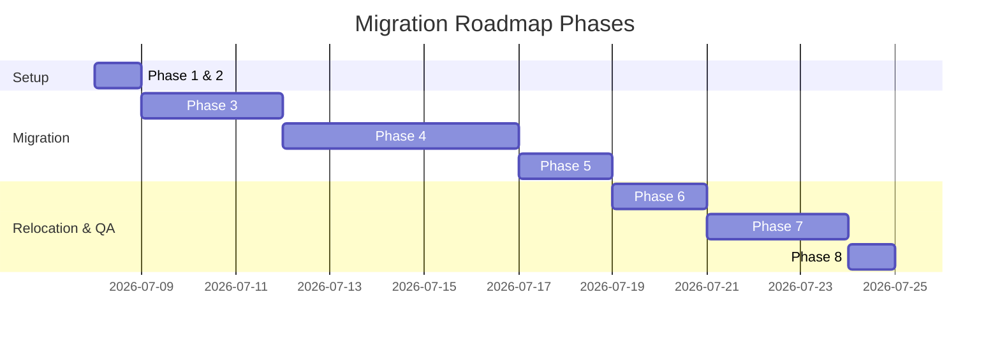

# Stateless Migration Plan

This document details the stepwise plan to refactor the legacy agent structures into the stateless translation engine (Libero) without disrupting existing features, data, or translations.

---

## Migration Roadmap

---

## Detailed Phases

### Phase 1 & 2: Docs and Skeleton (Current Phase)
- **Goal:** Outline the architecture, structures, and schemas, and set up folder skeletons with tracking files.
- **Tasks:**
  - Create architecture, workspace, book, pipeline, QA, and export documentation.
  - Set up empty folder structures containing `.gitkeep`.

### Phase 3: Core Library & Utilities Extraction
- **Goal:** Gather common functionalities into central, stateless modules.
- **Tasks:**
  - Standardize configuration loading from environmental variables and JSON profiles.
  - Implement shared HTML parsing and node manipulation helpers in `src/utils/`.
  - Consolidate LLM client invocations and prompt handlers in `src/core/`.

### Phase 4: Pipeline Stages Adaptation
- **Goal:** Refactor script files from legacy folders to take input paths, output paths, and parameters via functions rather than hardcoded variables.
- **Tasks:**
  - Refactor `agent-scrape/` scripts to `src/pipeline/scrape/` and `src/pipeline/cleanup/`.
  - Refactor `agent-analyze/` glossary and cultural analyzer tools to `src/pipeline/analyze/`.
  - Refactor `agent-translate/` templates and translation models to `src/pipeline/prep/` and `src/pipeline/translate/`.
  - Refactor QA checkers (integrity, glossary, reviews) to `src/qa/` and `src/pipeline/review/` / `src/pipeline/fix/`.
  - Refactor book compiling/packaging scripts to `src/pipeline/archive/` and `src/pipeline/build/`.

### Phase 5: CLI Entrypoint Implementation
- **Goal:** Construct the CLI shell to command the pipeline.
- **Tasks:**
  - Create commands for each step under `src/cli/commands/` using standard routing arguments.
  - Standardize help systems, execution logs, and exit code standards.

### Phase 6: Book Data Relocation
- **Goal:** Isolate translation work.
- **Tasks:**
  - Relocate any lingering book data folders (such as `entrepreneurship`) into the sibling `books/` workspace folder (e.g. `../books/entrepreneurship`).
  - Configure path mappings and test file resolutions.

### Phase 7: Smoke Testing & Validation
- **Goal:** Verify that the stateless codebase works identically to the legacy codebase.
- **Tasks:**
  - Run checks against test fixtures in `tests/fixtures/`.
  - Execute dry-runs on translated pages, matching logs and HTML hashes before and after migration.

### Phase 8: Legacy Clean-up
- **Goal:** Clean up the workspace repository.
- **Tasks:**
  - Move legacy directories (`/agents/`, old `/scripts/`, etc.) into `_Archive/` to ensure no accidental deletion of historic tools, as per local project rules.
